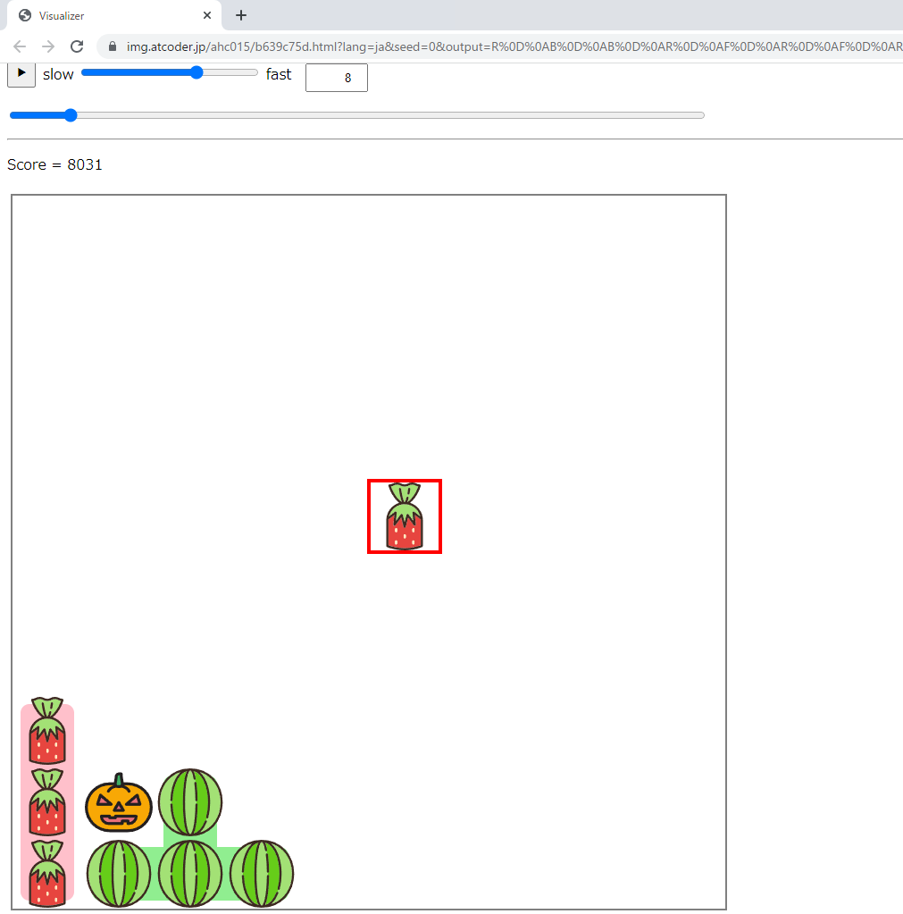
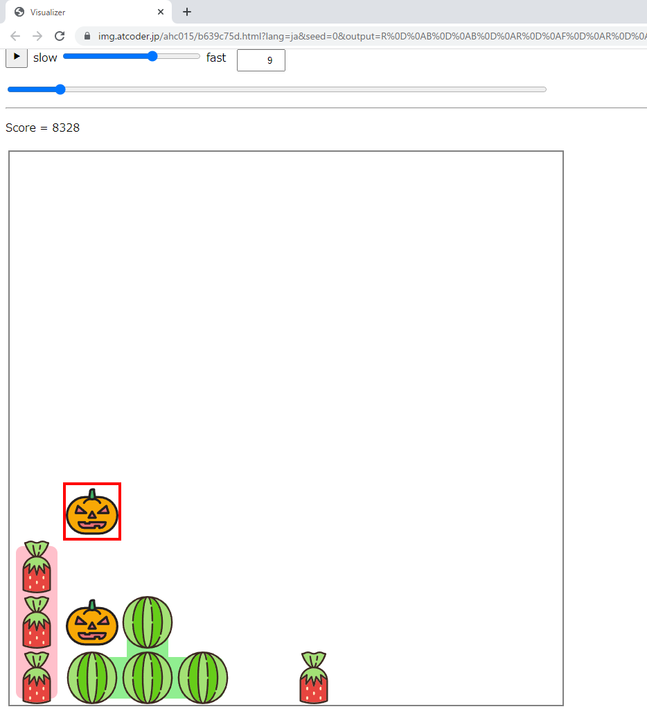

# 考察メモ

## 15時

推定系っぽい？まあ貪欲を考えるか

キャンディー1つを受け取って箱を傾けるので1ターン。どのキャンディが何個来るかなどは最初にわかる。位置がわからないのか。

**ランダムに傾ける**: seed0 10万点 提出28M

傾けたら何点になるか調べて一番高い向きに傾ける

**1ターン先読み**: seed0 35万点 提出69M

## 16時

ビジュアライザをよく見る。1ターン先読みの同点とかありそう

turn 8で来たイチゴを左に傾ければ、既にある連結成分と繋がる可能性が高いのに、下に傾けているのはもったいない

 

何も次のターン置かないとして2ターン傾けを先読みする？

**2ターン先読み(2ターン目は何も置かない)**: seed0 14万点 提出31M

さすがに2ターン目もどこかに置いた方がいいんじゃないか？？？

100ターン目はどこに傾けても変わらない（動かせないから）。って考えると重要なのは序盤なのかな？？？

**2ターン先読み(2ターン目はランダムに置く)**: seed0 29万点 提出90M

ここからの方針は

1. 2ターン目に置くやつをいろいろ試して精度を良くしようとする
2. 3,4,5ターン目と先読みターン数を増やす

の2通りに分かれる。とりあえず2.を試してみる。

**3ターン先読み(2,3ターン目はランダムに置く)**: seed0 47万点 提出93M

## 17時

**3ターン先読み(2,3ターン目はランダムに置く) 実装2**: seed0 63万点 提出87M

testerを用意して、100ケースローカル実行

**5ターン先読み(2ターン目以降はランダムに置く) 実装2**: seed0 32万点 local_score:92396398 提出90M 1366ms

ターン数を上げてもこのままじゃ伸びない！精度を上げる方をやろう

**置くやつをいろいろ試す（4個）** seed0 59万点 local_score:99868826 提出TLE…

**置くやつをいろいろ試す（3個）先読みは3ターン** seed0 55万点 local_score:103972056 提出100M 1719ms

上位k個だけ保存すればええか　ビームサーチ！

都合のいいところに置いたやつだけが保存されるようにならん？

**上位50個のスコアを超えないと遷移しない 置くやつをいろいろ試す（3個）先読みは3ターン** seed0 57万 local_score:101572556
提出97M 1747ms

パラメータが増えてきた optuna先生の出番か？

## 18時

もしくはchokudaiサーチにするのか　書いた記憶ないけど

いや～あと30分ちょいか　温かみのあるパラメータ調整くらいしかできない

**温かみのあるパラメータ調整** seed0 68万 local_score:102490764 提出98M 1648ms

ぐお～なんもできん

**seedガチャ** seed: 159640460

最後に提出したなにか 提出103M 終了……

**貪欲** https://twitter.com/_phocom/status/1586661601700380673 phocomさんのやつ、強すぎる…
